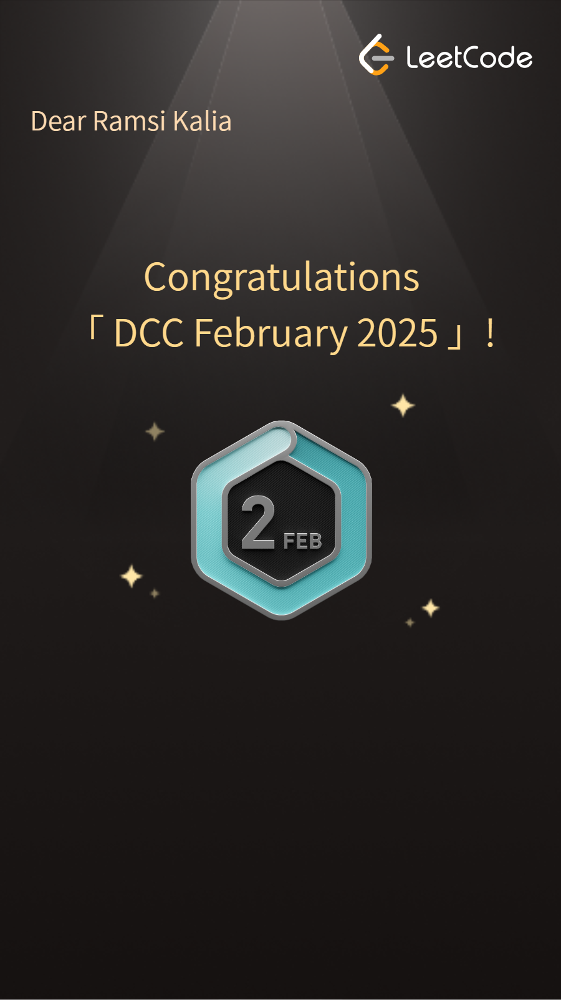
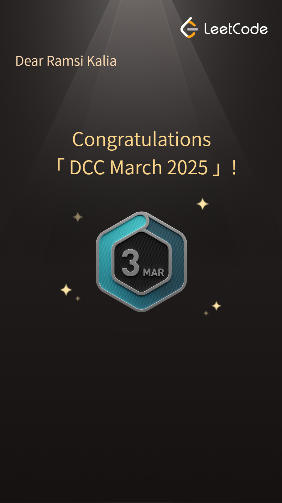
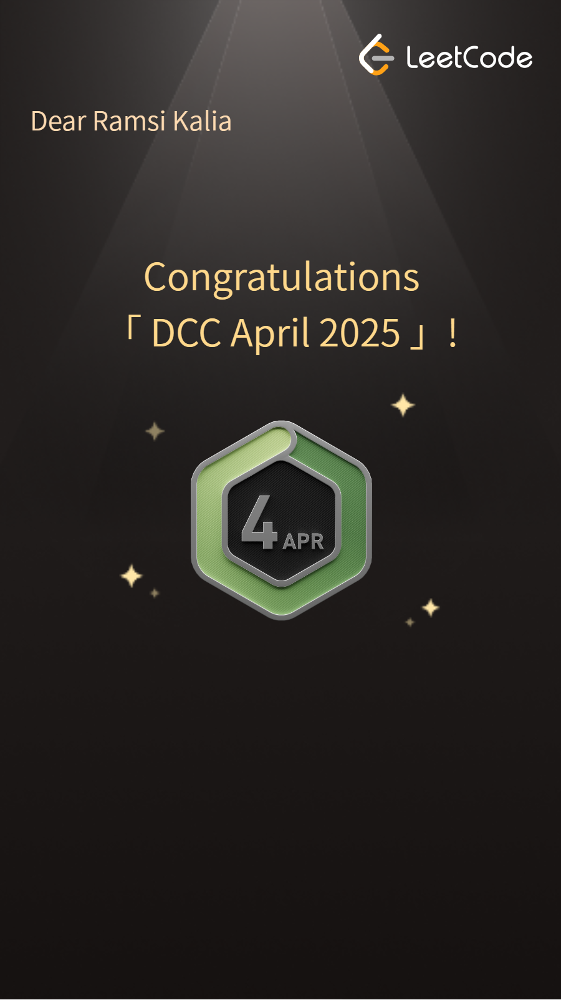
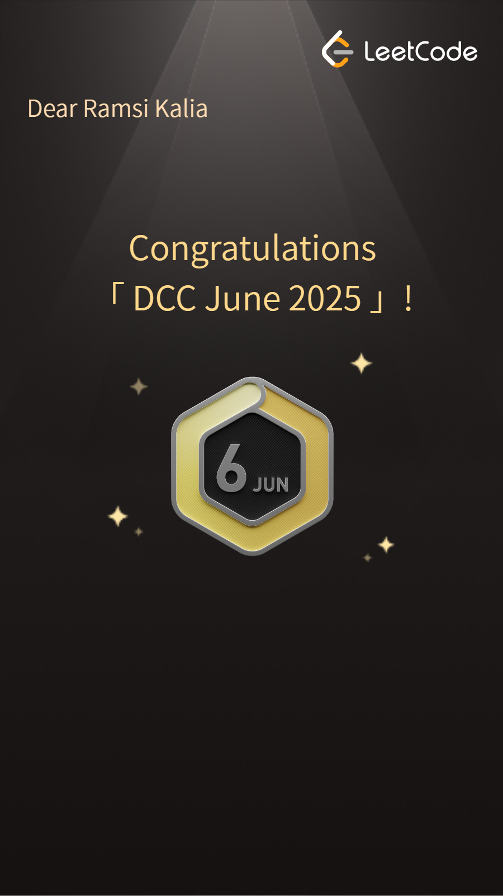
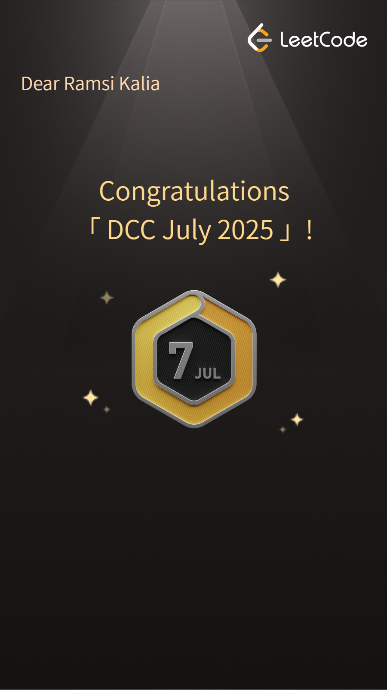
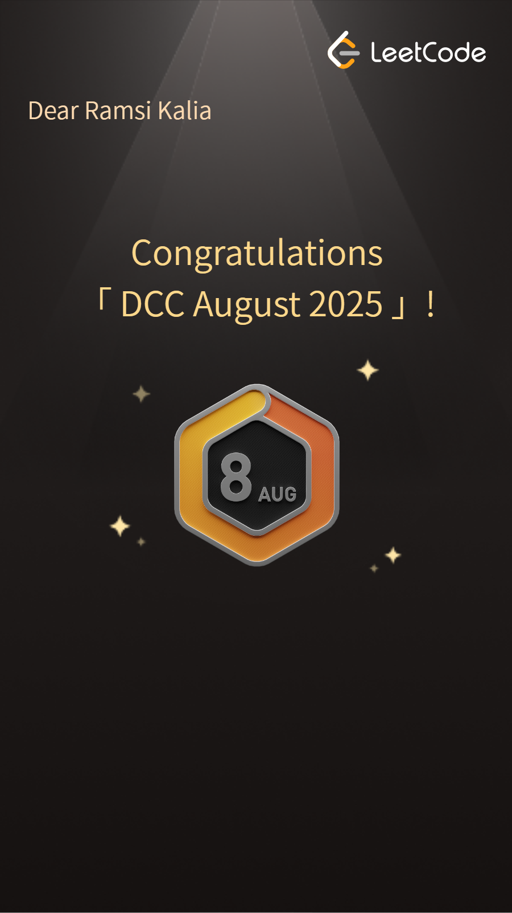
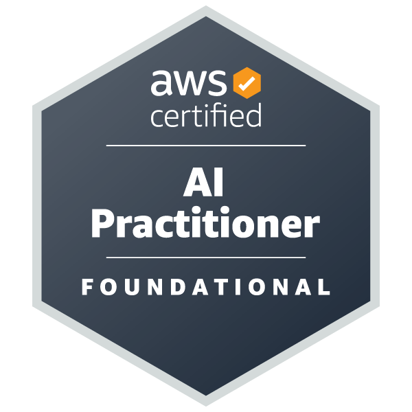
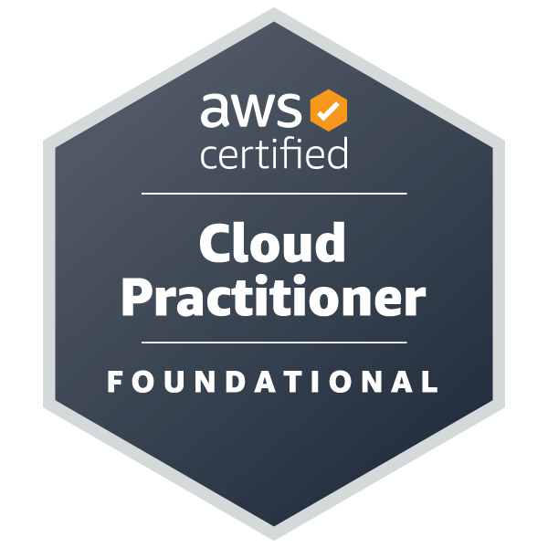
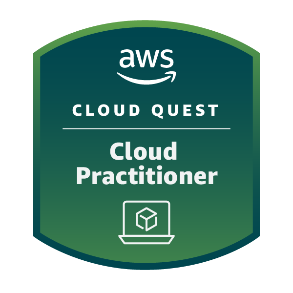
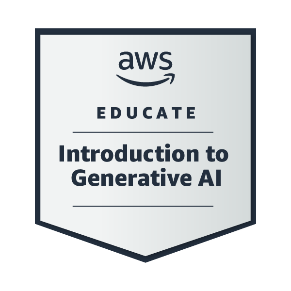

# 300 Days Of Code - Year 2 🚀

Welcome back to my coding journey!

This repository marks the second year of my 300 Days of Code challenge.

Last year focused heavily on daily logs and updates within the realm of vision technologies. This year, the focus shifts towards deeper dives into key bootcamps and substantial projects, moving away from daily standup-style logging.

The goal remains consistent: dedicated coding effort. However, the definition of a "minimum viable day" is now centered on completing the LeetCode daily challenge. This ensures consistent problem-solving practice while allowing for more flexibility to concentrate on larger learning modules and projects.

_This repo links out to submodules and folders containing detailed work and documentation._

---

## Challenge Structure

- **LeetCode**: Daily challenges (code in `/leetcode/`, certificates in `/certs/leetcode/`)
- **Bootcamps**: Each bootcamp tracked as a submodule
- **Projects**: Larger projects get their own folders
- **Milestones**: Progress logged via sprint highlights & project completions, not daily standups

### Strategic Learning Phases

Instead of tracking 365 individual days, I'm organizing the year into strategic learning phases:

| Phase | Primary Focus             | Timeline | Key Learning & Projects                                                                                                                                                                               |
| ----- | ------------------------- | -------- | ----------------------------------------------------------------------------------------------------------------------------------------------------------------------------------------------------- |
| 1     | Generative AI             | Jan–Apr  | Completed GenAI Bootcamp · Built multi-agent chatbots, RAG demos, ASR/TTS experiments                                                                                                                 |
| 2     | MCP & Multi-Agent Systems | May–Jul  | AWS AI Practitioner cert · Networking Bootcamp (multi-VPC design) · Agentic Comic Generator (Hugging Face Hackathon) · LLM Zoomcamp · 100DaysOfCloud Discord Bot · Discord MCP Server · Anthropic MCP |
| 3     | MCP Tooling & Cloud       | Aug–Oct  | Albumentations MCP Server (Kiro Hackathon) · Discord MCP Server · Language Learning GenAI App (OpenAI Open Model Hackathon) · AWS SAA (BeSA) prep · Korean B2 (KSI) · MLOps Zoomcamp · LLM Zoomcamp   |
| 4     | [TBD]                     | Nov–Dec  | To be defined                                                                                                                                                                                         |

> Note: Some tracks (e.g. certifications, Zoomcamps, MCP tools) span multiple phases. Phases are for showcasing emphasis.

---

### 🧱 Projects in Progress

- **LLM Zoomcamp (DataTalksClub, Jul–Oct 2025)**  
  Deep dive into LLM pipelines: vector search, RAG, evaluation, and monitoring.  
  Capstone project: building an end-to-end assistant with AWS integration.  
  → [Project Repo](https://github.com/Ramsi-K/llm-zoomcamp)

- **Discord MCP**  
  Modular Discord bot for managing discord communities. Features: member analytics, role-based tool access, observability hooks, and context-aware message rendering.  
  Built with Python, Discord API, and a custom tool orchestration layer.
  → [Project Repo](https://github.com/Ramsi-K/discord-mcp)

- **Albumentations MCP(Kiro Hackathon, Sept 2025)**  
  MCP-compliant image augmentation tool using Albumentations. Focused on safe, auditable augmentation pipelines.  
  → [Project Repo](https://github.com/Ramsi-K/albumentations-mcp)

- **Language Learning GenAI App (OpenAI Hackathon, Sept 2025)**  
  Fullstack application for AI-assisted Korean language learning, leveraging open models and MCP integration.  
  → [Project Repo](https://github.com/Ramsi-K/learn-korean-play-app)

## 🏆 Completed Projects & Outcomes

### Hugging Face Hackathon (Jun 2025)

- **Agentic Comic Generator (Hackathon Project)**  
  Hugging Face / LlamaIndex Hackathon submission. A multi-agent comic generation system powered by GPT-4o, SDXL, and LlamaIndex.

  - Dual-agent setup: `Agent Brown` (reasoning + critique) and `Agent Bayko` (image generation via Modal)
  - Custom LlamaIndex event system with persistent memory and structured state logging
  - Modal serverless endpoints for SDXL generation
  - Gradio UI with real-time agent feedback
  - Tech stack: GPT-4o, Mistral Codestral, Hugging Face Diffusers, Modal, Gradio
  - [View Certificate](/certs/other/Certificate-AgentsMCP-Hackathon-1753207993545_8171.png)

  → [Project Repo](https://github.com/Ramsi-K/agentic-comic-generator)

### GenAI Bootcamp (Feb–Apr 2025)

- ✅ **Completed 100% of all project submissions**
- 🔴 **Awarded RED SQUAD recognition** - highest grade awarded
- 📜 [View Certificate](certs/genai-bootcamp/certificate.pdf)
- 🧠 Focus Areas: TOGAF, ASR, TTS, AI assisted Language Learning, Agents, RAG, MUD games, handwriting recognition, multi-agent chatbots
- 💥 Challenges faced:
  - Struggled with frontend/backend integration
  - Major friction with deployment (Docker, Spaces, Firewalls)
  - Learned the importance of understanding cloud tools earlier in project cycles

### AWS Learning Highlights

- 🏅 [AWS Certified AI Practitioner](https://www.credly.com/badges/1f290b70-e366-4756-a959-413c8c3b4398/public_url)
- 🎓 [AWS Cloud Quest: Cloud Practitioner](https://www.credly.com/badges/7de75131-01cf-4d37-851b-cb63f6f39dae/public_url)
- 🏅 [AWS Certified Cloud Practitioner](https://www.credly.com/badges/684fdd1c-105a-4ee4-a472-f15381285ecd/public_url)
- 🤖 [AWS Educate Intro to Generative AI](https://www.credly.com/badges/17ad2294-e69a-4465-9d58-226109158cce/public_url)
- 🗣️ [AWS Skill Builder: Amazon Lex Getting Started](certs/aws/17999_5_861541_1746163529_AWSSkillBuilderCourseCompletionCertificate.pdf)

## 🧪 Certifications Gallery

### LeetCode Monthly Challenge Badges

| Jan                             | Feb                             | Mar                             | Apr                             | May                             | Jun                             |
| ------------------------------- | ------------------------------- | ------------------------------- | ------------------------------- | ------------------------------- | ------------------------------- |
|  |  |  |  |  |  |
| Jul                             | Aug                             | Sep                             | Oct                             | Nov                             | Dec                             |
|  |  |                                 |                                 |                                 |                                 |

---

### AWS Certifications

| AI Practitioner                                  | Cloud Practitioner                                  | Cloud Quest                                           | Intro to GenAI                                               |
| ------------------------------------------------ | --------------------------------------------------- | ----------------------------------------------------- | ------------------------------------------------------------ |
|  |  |  |  |

---

### Other Certifications

- [Introduction to Model Context Protocol](/certs/other/Introduction%20to%20Model%20Context%20Protocol.pdf)
- [Model Context Protocol: Advanced Topics](/certs/other/Model%20Context%20Protocol%20Advanced%20Topics.pdf)
- [MCP: Build Rich-Context AI Apps with Anthropic](https://learn.deeplearning.ai/accomplishments/b3ea9e3f-114a-4a5d-a00a-071ac3f3c30a?usp=sharing)
- [Practical Multi AI Agents and Advanced Use Cases with crewAI](https://learn.deeplearning.ai/accomplishments/5686ef40-8d2f-41be-9f46-08d60f0b1550?usp=sharing)
- [Korean Introductory Course KSI](/certs/other/KSI%20Introductory.pdf)
- [MLOps Zoomcamp](certs/other/DataTalks%20MLOps%20Zoomcamp.pdf)

---

## 📘 Research Papers

- “Turn Detection in AI Language Learning” → [Dissertation Link](https://www.academia.edu/128366473/Turn_Detection_in_AI_Powered_Language_Learning_Cultural_Neurodivergent_and_Ethical_Implications)
- “Beyond Human Mimicry: Rethinking AI Identity” → in progress
- Additional breakdowns from GenAI bootcamp to be published on [arXiv](https://arxiv.org/) or [Academia.edu](https://independentscholar.academia.edu/RamsiKalia)

### 🧪 Exploratory Topics

- **CFD Memory**  
  Investigating fluid-inspired memory systems where contextual relevance emerges from dynamic flow patterns rather than static vector weights.  
  _Focus:_ memory decay, attention turbulence, and mesh-based semantic diffusion.

- **Korea as an AI Testbed**  
  Exploring South Korea’s unique role as a contained ATS-friendly deployment zone for multilingual AI tooling.  
  _Emphasis:_ linguistic modeling, policy alignment, and interface testing across hyper-digital infrastructure.

---

## 📁 Repository Structure

- `leetcode/` → [LeetCode Daily Solutions (Submodule)](https://github.com/yourusername/leetcode-solutions)
- `certs/`
  - `leetcode/` → Monthly certificate images
  - `aws/` →
- `bootcamps/`
  - `genai/` → [GenAI Bootcamp Repo](bootcamps/genai)
  - `networking/` → [Networking Bootcamp Repo](bootcamps/networking)
- `courses/`
  - `*` → Optional self-paced courses
  <!-- - `papers/` – Research breakdowns, dissertations, longform writing -->

---

## 🔗 Useful Links

- [GenAI Bootcamp Journal](https://github.com/Ramsi-K/free-genai-bootcamp-2025/blob/main/journal.md)
- [LinkedIn](https://www.linkedin.com/in/ramsikalia/)
- [Academia.edu](https://independentscholar.academia.edu/RamsiKalia)

---

> ## Connect & Collaborate
>
> I believe in learning in public and welcome collaboration. If you're interested in any of the projects or want to pair program on algorithms, you can reach out to me via [LinkedIn](https://www.linkedin.com/in/ramsikalia/).
